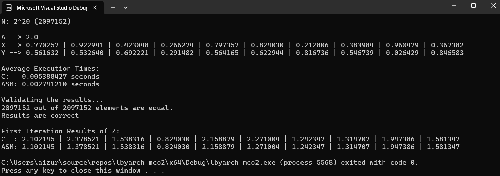
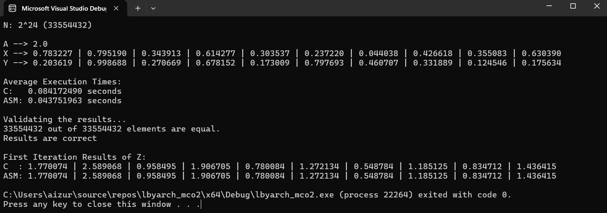
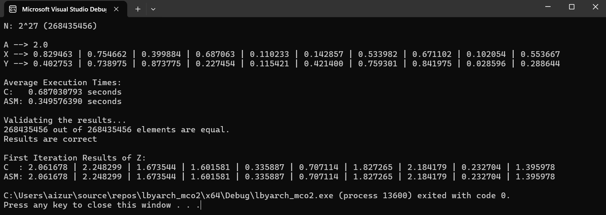
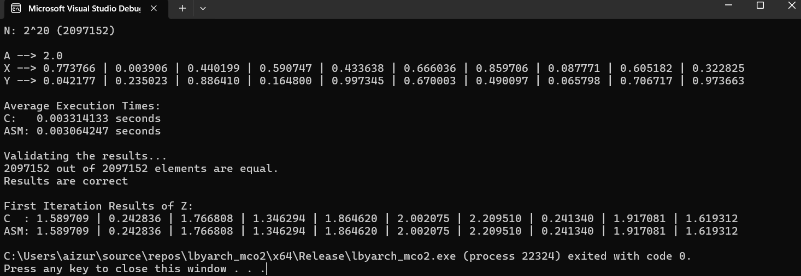
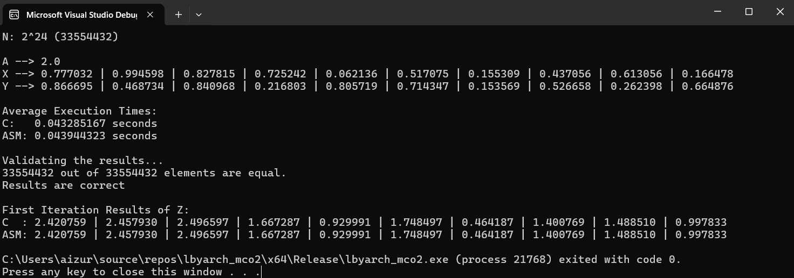
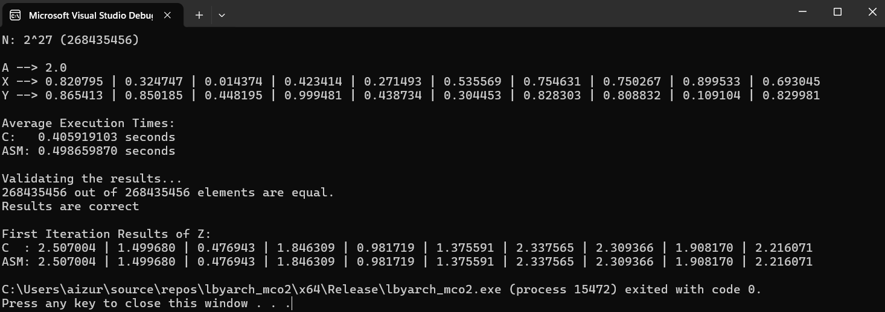

# DAXPY Kernel x86-64 and C Implementation & Performance Comparison | LBYARCH - S15
## Authors
- [@luii-hub](https://github.com/luii-hub) 
- [@zhoeaeris](https://github.com/zhoexaeris)

## DAXPY Function implemented on a C Kernel and x86-64 Assembly Kernel was tested in both Debug Mode and Release Mode across different sizes of input vectors.
### Debug Mode Screenshots

### Release Mode Screenshots

## Demo/ Analysis / Comparison
The performance of the two kernels was tested on the DAXPY Function with different vector sizes:
- 2^20 (or 1048576)
- 2^24 (or 16777216)
- 2^27 (or 134217728)

<table>
    <thead>
        <tr>
            <td>n (Size of X)</td>
            <td colspan=2 style="text-align: center;">2^20 (1,048,576)</td>
            <td colspan=2 style="text-align: center;">2^24 (16,777,216)</td>
            <td colspan=2 style="text-align: center;">2^27 (134,217,728)</td>
        </tr>
    </thead>
    <tbody>
        <tr>
            <td>Kernel</td>
            <td style="text-align: center;">C</td>
            <td style="text-align: center;">ASM</td>
            <td style="text-align: center;">C</td>
            <td style="text-align: center;">ASM</td>
            <td style="text-align: center;">C</td>
            <td style="text-align: center;">ASM</td>
        </tr>
        <tr>
            <td>Debug Mode</td>
            <td>0.005488427</td>
            <td>0.002741210</td>
            <td>0.084172490</td>
            <td>0.043751963</td>
            <td>0.687030793</td>
            <td>0.349576390</td>
        </tr>
        <tr>
            <td>Release Mode</td>
            <td>0.003314133</td>
            <td>0.003064247</td>
            <td>0.043285167</td>
            <td>0.043944323</td>
            <td>0.405919103</td>
            <td>0.498659870</td>
        </tr>
    </tbody>
</table>

Lorem Ipsum

